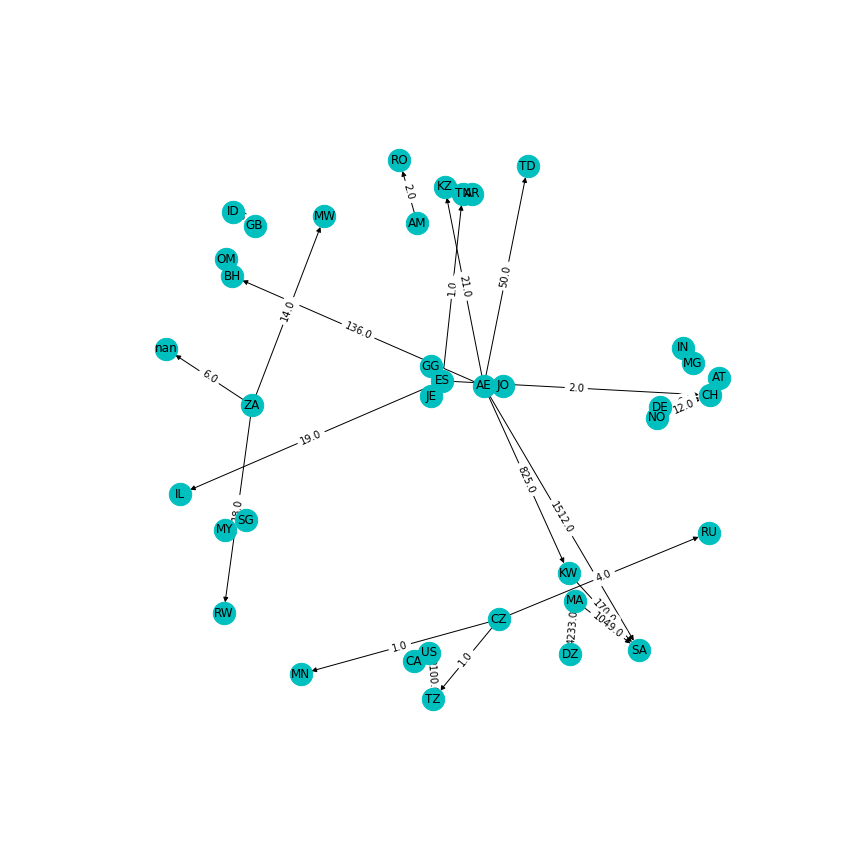

# CITES wildlife trade analysis

Collaborators: Daniel Tieleman, Laurens Edwards

## Data set

The CITES wildlife trade database (https://www.kaggle.com/cites/cites-wildlife-trade-database) consists of datapoints that repressent the legal import and export of endangered wildlife between countries in 2016. 

The data set contains the following columns:

- Year (year in which the export took place)
- App. (CITES appendix of species)
- Taxon
- Class 
- Order
- Family
- Genus
- Importer (country)
- Exporter (country)
- Origin (origin country of species)
- Imported reported quantity
- Exporter reported quantity
- Term (specification of exported species)
- Unit (unit of exported species)
- Purpose (purpose of export)
- Source (source of the data)


```python
import pandas as pd

wildlife = pd.read_csv("../Data/CITES_wildlife_trade_database.csv")
wildlife.head()
```


<div>
<style scoped>
    .dataframe tbody tr th:only-of-type {
        vertical-align: middle;
    }

    .dataframe tbody tr th {
        vertical-align: top;
    }

    .dataframe thead th {
        text-align: right;
    }
</style>
<table border="1" class="dataframe">
  <thead>
    <tr style="text-align: right;">
      <th></th>
      <th>Year</th>
      <th>App.</th>
      <th>Taxon</th>
      <th>Class</th>
      <th>Order</th>
      <th>Family</th>
      <th>Genus</th>
      <th>Importer</th>
      <th>Exporter</th>
      <th>Origin</th>
      <th>Importer reported quantity</th>
      <th>Exporter reported quantity</th>
      <th>Term</th>
      <th>Unit</th>
      <th>Purpose</th>
      <th>Source</th>
    </tr>
  </thead>
  <tbody>
    <tr>
      <th>0</th>
      <td>2016</td>
      <td>I</td>
      <td>Aquila heliaca</td>
      <td>Aves</td>
      <td>Falconiformes</td>
      <td>Accipitridae</td>
      <td>Aquila</td>
      <td>TR</td>
      <td>NL</td>
      <td>CZ</td>
      <td>NaN</td>
      <td>1.0</td>
      <td>bodies</td>
      <td>NaN</td>
      <td>T</td>
      <td>C</td>
    </tr>
    <tr>
      <th>1</th>
      <td>2016</td>
      <td>I</td>
      <td>Aquila heliaca</td>
      <td>Aves</td>
      <td>Falconiformes</td>
      <td>Accipitridae</td>
      <td>Aquila</td>
      <td>XV</td>
      <td>RS</td>
      <td>RS</td>
      <td>NaN</td>
      <td>1.0</td>
      <td>bodies</td>
      <td>NaN</td>
      <td>Q</td>
      <td>O</td>
    </tr>
    <tr>
      <th>2</th>
      <td>2016</td>
      <td>I</td>
      <td>Haliaeetus albicilla</td>
      <td>Aves</td>
      <td>Falconiformes</td>
      <td>Accipitridae</td>
      <td>Haliaeetus</td>
      <td>BE</td>
      <td>NO</td>
      <td>NaN</td>
      <td>NaN</td>
      <td>43.0</td>
      <td>feathers</td>
      <td>NaN</td>
      <td>S</td>
      <td>W</td>
    </tr>
    <tr>
      <th>3</th>
      <td>2016</td>
      <td>I</td>
      <td>Haliaeetus albicilla</td>
      <td>Aves</td>
      <td>Falconiformes</td>
      <td>Accipitridae</td>
      <td>Haliaeetus</td>
      <td>BE</td>
      <td>NO</td>
      <td>NaN</td>
      <td>NaN</td>
      <td>43.0</td>
      <td>specimens</td>
      <td>NaN</td>
      <td>S</td>
      <td>W</td>
    </tr>
    <tr>
      <th>4</th>
      <td>2016</td>
      <td>I</td>
      <td>Haliaeetus albicilla</td>
      <td>Aves</td>
      <td>Falconiformes</td>
      <td>Accipitridae</td>
      <td>Haliaeetus</td>
      <td>DK</td>
      <td>IS</td>
      <td>NaN</td>
      <td>700.0</td>
      <td>NaN</td>
      <td>specimens</td>
      <td>NaN</td>
      <td>S</td>
      <td>W</td>
    </tr>
  </tbody>
</table>
</div>


## Analysis

For this analysis we were interested in the export of species that were exported with the purpose of reintroduction into the wild. In order to get an overview of this we searched for the countries that exported the most with this purpose. We used an dictionary to store this information. Since only either the import or export quantity were specified per data point we first checked if the export quantity was specified and if not we used the import quantity. For each country we summed these quantities and then used matplotlib to plot a bar plot of the total export per country with the purpose of reintroduction into the wild.


After this we were curious about the export relationship between countries. For this we used the data in a similar way compared to the former analysis but instead of summing all export quantities we stored them separate to graph every interaction in the export network. In the following graph each node represents a country and every edge represents an export with the value indicating the export quantity.



# Dependencies

- pandas
- matplotlib.pyplot
- networkx
